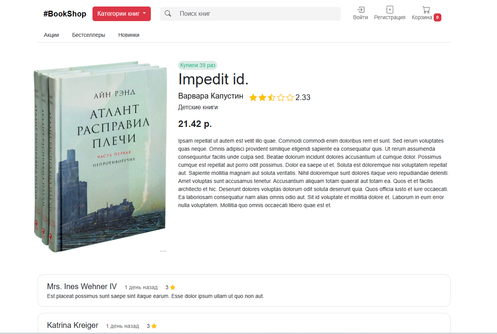
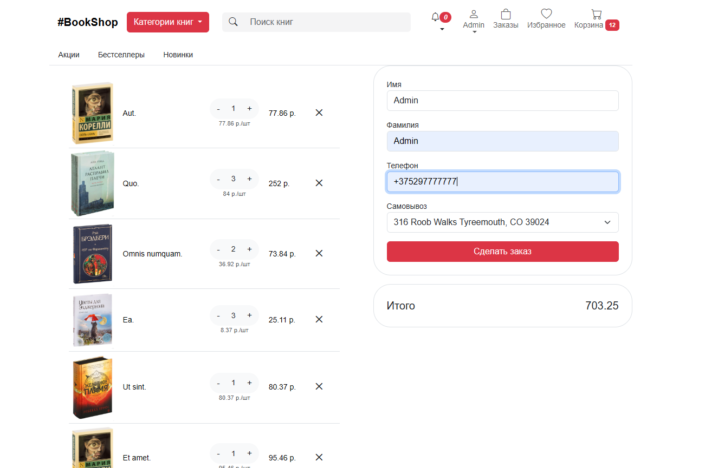
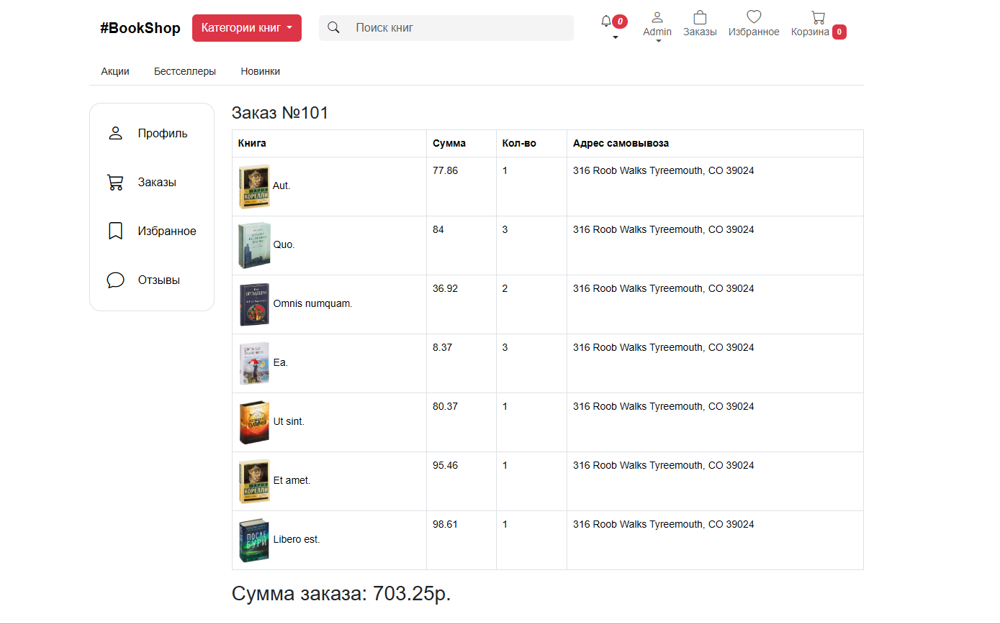
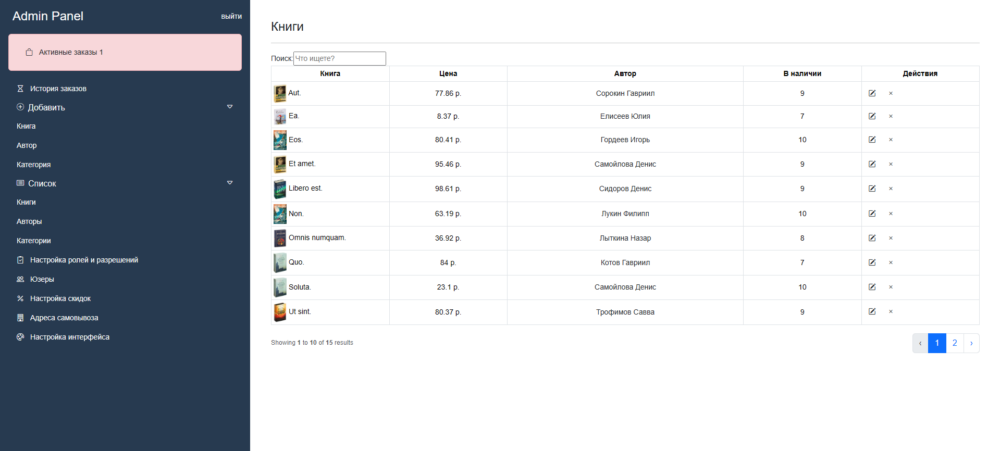
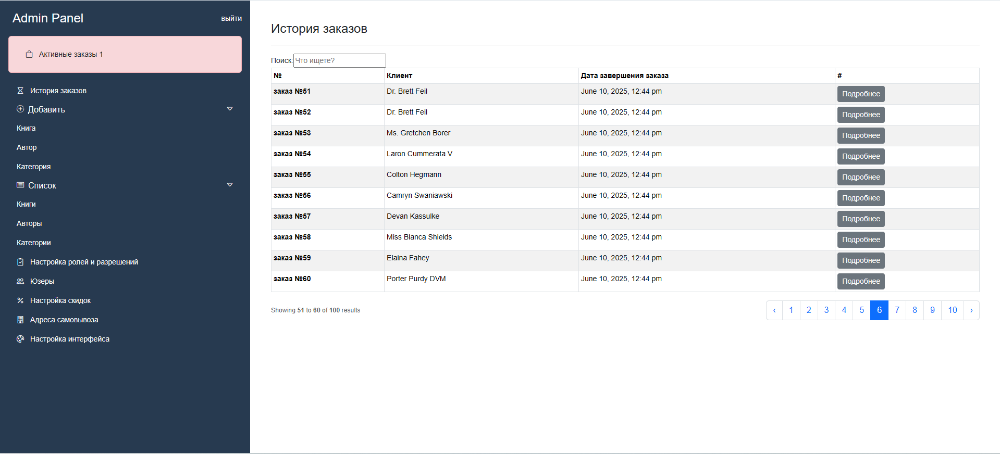
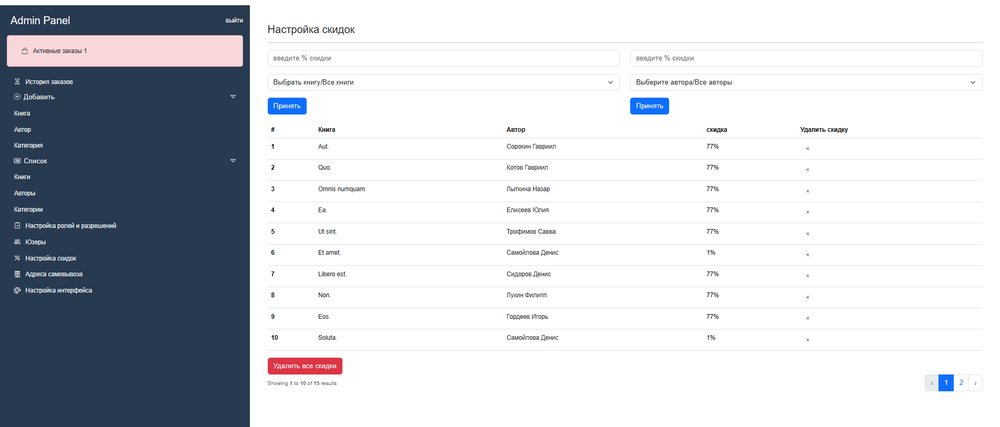
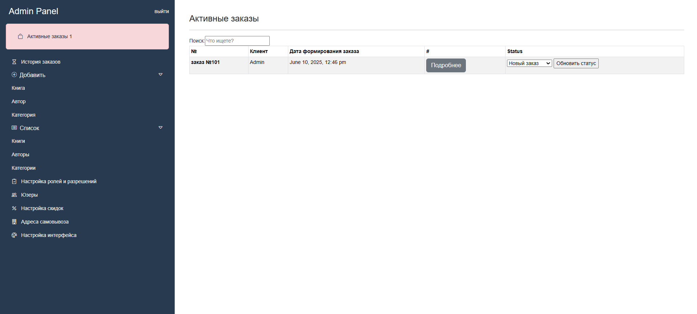

# BookShop
Магазин книг

## 🚀 Возможности
✅ Покупка книг — удобный процесс выбора книг с возможностью просмотра истории покупок.

✅ Добавление в избранное — пользователи могут сохранять понравившиеся книги для быстрого доступа в будущем.

✅ Оценка и отзывы — после покупки пользователь может оставить оценку и отзыв, чтобы помочь другим выбрать лучшие книги.

✅Категоризация и фильтры — удобный поиск по жанрам, авторам, рейтингу и цене.

✅Управление профилем — пользователи могут редактировать личные данные и просматривать статус заказов.

## ⚙️ Установка

```bash
# Клонируем репозиторий
git clone https://github.com/sk1pY/bookshop.git
cd bookshop

# Запускаем установку
bash setup.sh
```
## ⚙️ Дополнительное
### Почта
http://localhost:8025/

### Админ акк
логин: admin@admin.com

пароль: admin

## Скриншоты










